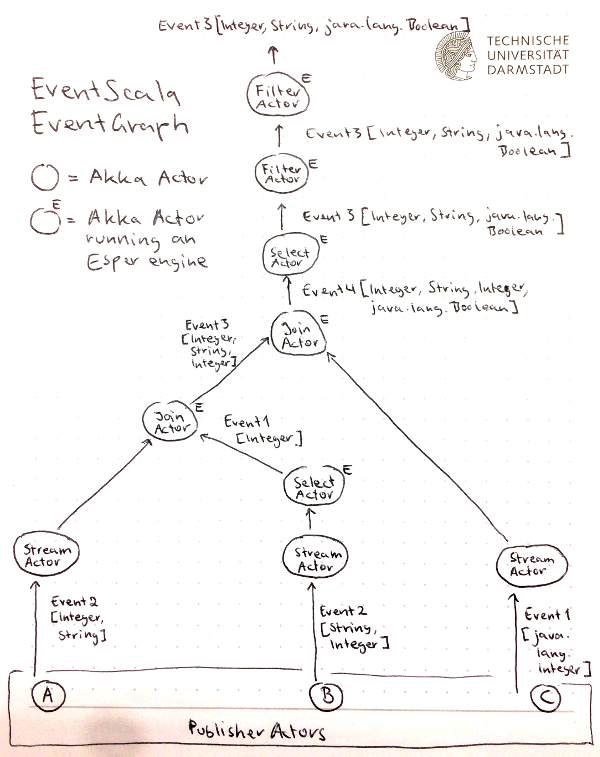

# EventScala

EventScala is a research project exploring ways to embed quality of service requirements into queries for event processing systems. As such, its main contributions are:

+ **EventScala DSL** for _expressing_ EP queries including QoS requirements
+ **EventScala EventGraph** for _executing_ EP queries including QoS requirements

EventScala DSL is simply an embedded Scala DSL. EventScala EventGraph is a tree of Akka actors representing a query, where each actor represents a primitive or an operator of the query.

As of now, no QoS features have been implemented yet. However, the goal is that _each actor_ will be able to enfore QoS requirements, which means that these requirements may be injected in a really fine-grained fashion: It will be possible to define them over primitives and operators, i.e., over every subquery or the whole query.

**Demo: Doing `sbt run` in the project root will cause a sample query to execute! Check it out!**

## Table of Contents
+ [EventScala DSL](#eventscala-dsl)
    + [Primitives](#primitives)
    + [Operators](#operators)
    + [Case class representation](#case-class-representation)
+ [EventScala EventGraph](#eventscala-eventgraph)

## EventScala DSL

EventScala DSL is the domain-specific language to express event processing queries. Queries are made up of primitives and operators and can be arbitrarily nested and composed.

Internally, queries expressed using EventScala DSL are represented by case classes. This case class representation can then be passed to EventScala EventGraph for execution, but it may also be interpreted by another backend.

### Primitives

+ Subscription to a `stream`

    + Example 1: Subscription to a stream of event instances of type `Event2[Integer, String]`:

    ```scala
    val q: Query =
      stream[Integer, String].from("A")
    ```

### Operators

+ `join` of two streams

    + Example 1: `join` of two primitive streams:

    ```scala
    val q1: Query = 
      stream[Integer, String].from("A")
      .join(stream[String, Integer].from("B")).in(slidingWindow(3 seconds), tumblingWindow(3 instances))
    ```

    + Example 2: `join` of a primitive and a complex stream:

    ```scala
    val q2: Query =
      stream[java.lang.Boolean].from("C")
      .join(q1).in(slidingWindow(2 instances), tumblingWindow(2 seconds))
    ```

    + Available windows:

    ```scala
    slidingWindow(x instances)
    slidingWindow(x seconds)
    tumblingWindow(x instances)
    tumblingWindow(x seconds)
    ```

+ `select` elements of event instances

     + Example 1: Transforming a stream of event instances of type `Event2[Integer, String]` into a stream of event instances of type `Event1[String]`

    ```scala
    val q1: Query =
      stream[Integer, String].from("A")
      .select(elements(2))
    ```

     + Example 2: Transforming a stream of event instances of type `Event4[Integer, String, String, Integer]` into a stream of event instances of type `Event2[String, String]`

    ```scala
    val q2: Query = 
      stream[Integer, String].from("A")
      .join(stream[String, Integer].from("B")).in(slidingWindow(3 seconds), tumblingWindow(3 instances))
      .select(elements(2, 3))
    ```

+ Filtering over elements of event instances

    + Example 1: Only keep those event instances `where` element 2 is smaller than 10.

    ```scala
    val q1: Query =
      stream[String, Integer].from("A")
      .where(element(2) :<: literal(10))
    ```

    + Example 2: Only keep those event instances `where` element 1 equals element 2.

    ```scala
    val q2: Query =
      stream[java.lang.Boolean, java.lang.Boolean].from("D")
      .where(element(1) =:= element(2))
    ```

    + Available comparison operators:
              
    ```scala
    =:= // Equal
    !:= // NotEqual
    :>: // Greater
    >:= // GreaterEqual
    :<: // Smaller
    <:= // SmallerEqual
    ```
              
### Case class representation

Below find a more complex query expressed in EventScala DSL as well as in the case class representation mentioned above.

```scala
val subquery: Query =
  stream[String, Integer].from("B")
  .select(elements(2))

val query: Query =
  stream[Integer, String].from("A")
  .join(subquery).in(slidingWindow(3 instances), tumblingWindow(3 seconds))
  .join(stream[java.lang.Boolean].from("C")).in(slidingWindow(1 instances), slidingWindow(1 instances))
  .select(elements(1, 2, 4))
  .where(element(1) <:= literal(15))
  .where(literal(true) =:= element(3))
       
val queryCaseClassRepresentation: Query =
  Filter(
    Filter(
      Select(
        Join(
          Join(
            Stream2("A")[Integer, String],
            LengthSliding(3),
            Select(
              Stream2("B")[String, Integer],
              List(2)),
            TimeTumbling(3)),
          LengthSliding(1),
          Stream1("C")[java.lang.Boolean],
          LengthSliding(1)),
        List(1, 2, 4)),
      SmallerEqual,
      Left(1),
      Right(15)),
    Equal,
    Right(true),
    Left(3))
```

## EventScala EventGraph

As said, the EventScala EventGraph is a tree of Akka actors representing a query, with each actor representing a primitive or an operator of that query. Given a query as well as the `ActorRef`s to the event publishers, the EventGraph will automatically build and start emitting events.

A node representing a primitive (so far, there's only one primitive: a subscription to a stream) is just a plain Akka actor subscribing to the respective publisher, whereas nodes representing operators are all running an independent instance of the Esper event processing engine.

Below, find a mockup of what the EventGraph for the [query above](#case-class-representation) would look like.


